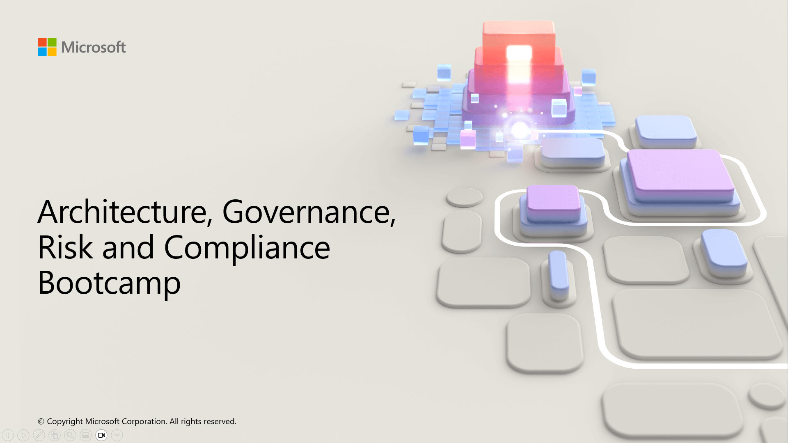

### Frameworks

[Microsoft Azure Cloud Adoption Framework - Overview](https://docs.microsoft.com/azure/cloud-adoption-framework/overview?WT.mc_id=AZ-MVP-5002880)\
[Microsoft Azure Well-Architected Framework](https://learn.microsoft.com/azure/well-architected/?WT.mc_id=AZ-MVP-5002880)\
[Microsoft Cyber Security Reference Architecture (MCRA)](https://learn.microsoft.com/security/adoption/mcra?WT.mc_id=AZ-MVP-5002880)\
[Microsoft Zero Trust Model](https://www.microsoft.com/security/business/zero-trust?WT.mc_id=AZ-MVP-5002880)\
[Zero Trust Guidance Center](https://learn.microsoft.com/security/zero-trust/zero-trust-overview?WT.mc_id=AZ-MVP-5002880)

### Design a migration solution

[Azure migration guide overview](https://learn.microsoft.com/en-us/azure/cloud-adoption-framework/migrate/?WT.mc_id=AZ-MVP-5002880)\
[Azure cloud migration best practices checklist](https://learn.microsoft.com/en-us/azure/cloud-adoption-framework/migrate/?WT.mc_id=AZ-MVP-5002880)\
[Microsoft Cloud Adoption Framework (CAF) for Azure](https://learn.microsoft.com/en-us/training/modules/microsoft-cloud-adoption-framework-for-azure/?WT.mc_id=AZ-MVP-5002880)\
[Cloud Adoption Framework (CAF) - Secure | Microsoft Learn Training Module](https://learn.microsoft.com/azure/cloud-adoption-framework/secure?WT.mc_id=AZ-MVP-5002880)\
[Cloud Adoption Security Review (Assessment)](https://learn.microsoft.com/assessments/93dfb79b-71af-404d-897e-3928ecfb92b1/?WT.mc_id=AZ-MVP-5002880)\
[Azure Well-Architected Framework (WAF) - Security design principles](https://learn.microsoft.com/en-us/azure/well-architected/security/principles?WT.mc_id=AZ-MVP-5002880)\
[Microsoft Cybersecurity Reference Architectures (MCRA)](https://learn.microsoft.com/security/adoption/mcra?WT.mc_id=AZ-MVP-5002880)\
[Overview of Microsoft Cloud Security Benchmark (MCSB)](https://learn.microsoft.com/security/benchmark/azure/introduction?WT.mc_id=AZ-MVP-5002880)\
[Microsoft Cloud Adoption Framework for Azure - Migrate](https://learn.microsoft.com/azure/cloud-adoption-framework/migrate?WT.mc_id=AZ-MVP-500288)\
[Planning for an Azure File Sync deployment](https://learn.microsoft.com/azure/storage/file-sync/file-sync-planning?WT.mc_id=AZ-MVP-5002880)\
[Migrate to SMB Azure file shares](https://learn.microsoft.com/azure/storage/files/storage-files-migration-overview?WT.mc_id=AZ-MVP-5002880)\
[Storage Migration Service overview](https://docs.microsoft.com/windows-server/storage/storage-migration-service/overview?WT.mc_id=AZ-MVP-5002880)\
[When would you use the Windows Storage Migration Service?](https://learn.microsoft.com/windows-server/storage/storage-migration-service/overview?WT.mc_id=AZ-MVP-5002880)\
[What is Azure Import/Export service?](https://learn.microsoft.com/azure/import-export/storage-import-export-service?WT.mc_id=AZ-MVP-5002880)\
[Export large amounts of data from Azure by using Azure Import/Export | Microsoft Learn Training Module](https://docs.microsoft.com/learn/modules/export-data-with-azure-import-export/?WT.mc_id=AZ-MVP-5002880)\
[When would you use Data Box?](https://learn.microsoft.com/azure/databox/data-box-overview/?WT.mc_id=AZ-MVP-5002880)\
[What other tools can you use to import/export moderate volumes of data?](https://learn.microsoft.com/azure/storage/common/storage-use-azcopy-v10/?WT.mc_id=AZ-MVP-5002880)

### Design solutions that align with security best practices and priorities

[Guiding principles of Zero Trust](https://learn.microsoft.com/azure/security/fundamentals/zero-trust?WT.mc_id=AZ-MVP-5002880#guiding-principles-of-zero-trust)\
[Azure security technical capabilities](https://learn.microsoft.com/en-us/azure/security/fundamentals/technical-capabilities?WT.mc_id=AZ-MVP-5002880)\
[Security services and technologies available on Azure](https://learn.microsoft.com/azure/security/fundamentals/services-technologies?WT.mc_id=AZ-MVP-5002880)\
[Azure security best practices and patterns](https://learn.microsoft.com/azure/security/fundamentals/best-practices-and-patterns?WT.mc_id=AZ-MVP-5002880)\
[SC-100: Design solutions that align with security best practices and priorities | Microsoft Learn Training Module](https://learn.microsoft.com/en-us/training/paths/sc-100-design-solutions-best-practices-priorities/?WT.mc_id=AZ-MVP-5002880)

### Design Authentication and Authorization Solutions

[Design solutions for identity and access management | Microsoft Learn Training Module](https://learn.microsoft.com/training/modules/design-solutions-identity-access-management/?WT.mc_id=AZ-MVP-5002880)\
[Azure Identity Management Security overview](https://docs.microsoft.com/azure/security/fundamentals/identity-management-overview?WT.mc_id=AZ-MVP-5002880)\
[What is Microsoft Entra ID?](https://learn.microsoft.com/entra/fundamentals/whatis?WT.mc_id=AZ-MVP-5002880)\
[Introduction to Microsoft Entra External ID](https://learn.microsoft.com/entra/external-id/external-identities-overview?WT.mc_id=AZ-MVP-5002880)\
[Microsoft Entra B2B best practices](https://learn.microsoft.com/entra/external-id/b2b-fundamentals?WT.mc_id=AZ-MVP-5002880)\
[What is Azure Active Directory B2C?](https://learn.microsoft.com/azure/active-directory-b2c/overview?WT.mc_id=AZ-MVP-5002880)\
[AuWhat is Microsoft Entra authentication?](hhttps://learn.microsoft.com/entra/identity/authentication/overview-authentication?WT.mc_id=AZ-MVP-5002880)\
[What is Microsoft Entra Connect?](https://learn.microsoft.com/entra/identity/hybrid/connect/whatis-azure-ad-connect?WT.mc_id=AZ-MVP-5002880)\
[Microsoft Entra Connect Sync](https://learn.microsoft.com/entra/identity/hybrid/connect/how-to-connect-sync-whatis?WT.mc_id=AZ-MVP-5002880)\
[Choose the right authentication method for your Microsoft Entra hybrid identity solution](https://learn.microsoft.com/entra/identity/hybrid/connect/choose-ad-authn?WT.mc_id=AZ-MVP-5002880)\
[What are Azure management groups?](https://learn.microsoft.com/azure/governance/management-groups/overview?WT.mc_id=AZ-MVP-5002880)\
[Manage your Azure subscriptions at scale with management groups](https://learn.microsoft.com/azure/governance/management-groups/manage?WT.mc_id=AZ-MVP-5002880)\
[What is Azure role-based access control (Azure RBAC)?](https://learn.microsoft.com/azure/role-based-access-control/overview?WT.mc_id=AZ-MVP-5002880)\
[Differences between Azure roles and Microsoft Entra roles](https://learn.microsoft.com/azure/role-based-access-control/rbac-and-directory-admin-roles?WT.mc_id=AZ-MVP-5002880#differences-between-azure-roles-and-microsoft-entra-roles)\
[Azure built-in roles](https://learn.microsoft.com/azure/role-based-access-control/built-in-roles?WT.mc_id=AZ-MVP-5002880)\
[Understand roles in Microsoft Entra ID](https://learn.microsoft.com/entra/identity/role-based-access-control/concept-understand-roles?WT.mc_id=AZ-MVP-5002880)\
[What is Conditional Access?](https://learn.microsoft.com/entra/identity/conditional-access/overview?WT.mc_id=AZ-MVP-5002880)\
[Plan a Conditional Access deployment](https://learn.microsoft.com/entra/identity/conditional-access/plan-conditional-access?WT.mc_id=AZ-MVP-5002880)\
[What is Microsoft Entra Privileged Identity Management?](https://learn.microsoft.com/entra/id-governance/privileged-identity-management/pim-configure?WT.mc_id=AZ-MVP-5002880)\
[What is entitlement management?](https://learn.microsoft.com/entra/id-governance/entitlement-management-overview?WT.mc_id=AZ-MVP-5002880)\
[Common scenarios in entitlement management](https://learn.microsoft.com/entra/id-governance/entitlement-management-scenarios?WT.mc_id=AZ-MVP-5002880)\
[Plan a Microsoft Entra access reviews deployment](https://learn.microsoft.com/entra/id-governance/deploy-access-reviews?WT.mc_id=AZ-MVP-5002880)\
[What are managed identities for Azure resources?](https://learn.microsoft.com/entra/identity/managed-identities-azure-resources/overview?WT.mc_id=AZ-MVP-5002880)\
[Azure Key Vault basic concepts](https://learn.microsoft.com/azure/key-vault/general/basic-concepts?WT.mc_id=AZ-MVP-5002880)\
[Azure Key Vault security](https://learn.microsoft.com/azure/key-vault/general/security-features?WT.mc_id=AZ-MVP-5002880)\
[Authentication in Azure Key Vault](https://learn.microsoft.com/azure/key-vault/general/authentication?WT.mc_id=AZ-MVP-5002880)\
[Design authentication and authorization solutions | Case Study](https://microsoftlearning.github.io/AZ-305-DesigningMicrosoftAzureInfrastructureSolutions/Instructions/CaseStudy/07-Access.html?WT.mc_id=AZ-MVP-5002880)

### Design a Governance solution

[Govern overview | Cloud adoption Framework for Azure](https://learn.microsoft.com/azure/cloud-adoption-framework/govern/?WT.mc_id=AZ-MVP-5002880)\
[Design Management Groups](https://learn.microsoft.com/azure/cloud-adoption-framework/ready/landing-zone/design-area/resource-org-management-groups?WT.mc_id=AZ-MVP-5002880)\
[Subscription considerations and recommendations](https://learn.microsoft.com/azure/cloud-adoption-framework/ready/landing-zone/design-area/resource-org-subscriptions?WT.mc_id=AZ-MVP-5002880)\
[What is Azure Resource Manager?](https://learn.microsoft.com/azure/azure-resource-manager/management/overview?WT.mc_id=AZ-MVP-5002880)\
[Resource naming and tagging decision guide](https://learn.microsoft.com/azure/cloud-adoption-framework/ready/azure-best-practices/resource-naming-and-tagging-decision-guide?WT.mc_id=AZ-MVP-5002880)\
[What is Azure Policy?](https://learn.microsoft.com/azure/governance/policy/overview?WT.mc_id=AZ-MVP-5002880)\
[What is Azure role-based access control (Azure RBAC)?](https://learn.microsoft.com/azure/role-based-access-control/overview?WT.mc_id=AZ-MVP-5002880)\
[What is Azure attribute-based access control (Azure ABAC)?](https://learn.microsoft.com/azure/role-based-access-control/conditions-overview?WT.mc_id=AZ-MVP-5002880)\
[What is an Azure landing zone?](https://learn.microsoft.com/azure/cloud-adoption-framework/ready/landing-zone/?WT.mc_id=AZ-MVP-5002880)

### Design a Compute solution

[Choose an Azure compute service](https://learn.microsoft.com/azure/architecture/guide/technology-choices/compute-decision-tree?WT.mc_id=AZ-MVP-5002880)\
[Design an Azure compute solution | Microsoft Learn Training Module](https://learn.microsoft.com/training/modules/design-compute-solution/?WT.mc_id=AZ-MVP-5002880)\
[Virtual machines in Azure](https://learn.microsoft.com/azure/virtual-machines/overview?WT.mc_id=AZ-MVP-5002880)\
[Sizes for virtual machines in Azure](https://learn.microsoft.com/azure/virtual-machines/sizes/overview?WT.mc_id=AZ-MVP-5002880)\
[Azure Arc overview](https://learn.microsoft.com/azure/azure-arc/overview?WT.mc_id=AZ-MVP-5002880)\
[What is Azure Batch?](https://learn.microsoft.com/azure/batch/batch-technical-overview?WT.mc_id=AZ-MVP-5002880)\
[App Service overview](https://learn.microsoft.com/azure/app-service/overview?WT.mc_id=AZ-MVP-5002880)\
[What is Azure Container Instances?](https://learn.microsoft.com/azure/container-instances/container-instances-overview?WT.mc_id=AZ-MVP-5002880)\
[Introduction to Azure Container Registry](https://learn.microsoft.com/azure/container-registry/container-registry-intro?WT.mc_id=AZ-MVP-5002880)\
[What is Azure Kubernetes Service (AKS)?](https://learn.microsoft.com/azure/aks/what-is-aks?WT.mc_id=AZ-MVP-5002880)\
[Azure Functions overview](https://learn.microsoft.com/azure/azure-functions/functions-overview?WT.mc_id=AZ-MVP-5002880)\
[Azure Functions scenarios](https://learn.microsoft.com/azure/azure-functions/functions-scenarios?WT.mc_id=AZ-MVP-5002880)\
[What is Azure Logic Apps?](https://learn.microsoft.com/azure/logic-apps/logic-apps-overview?WT.mc_id=AZ-MVP-5002880)

### Design a Non-relational Data Storage solution

[Design a data storage solution for non-relational data | Microsoft Learn Training Module](https://learn.microsoft.com/training/modules/design-data-storage-solution-for-non-relational-data/?WT.mc_id=AZ-MVP-5002880)\
[Introduction to Azure Storage](https://learn.microsoft.com/azure/storage/common/storage-introduction?toc=%2Fazure%2Fstorage%2Fblobs%2Ftoc.json&bc=%2Fazure%2Fstorage%2Fblobs%2Fbreadcrumb%2Ftoc.json&WT.mc_id=AZ-MVP-5002880)\
[Azure Storage redundancy](https://learn.microsoft.com/azure/storage/common/storage-redundancy?toc=%2Fazure%2Fstorage%2Fblobs%2Ftoc.json&bc=%2Fazure%2Fstorage%2Fblobs%2Fbreadcrumb%2Ftoc.json&WT.mc_id=AZ-MVP-5002880)\
[Introduction to Azure Blob Storage](https://learn.microsoft.com/azure/storage/blobs/storage-blobs-introduction?WT.mc_id=AZ-MVP-5002880)\
[Access tiers for blob data](https://learn.microsoft.com/azure/storage/blobs/access-tiers-overview?WT.mc_id=AZ-MVP-5002880)\
[What is Azure Files?](https://learn.microsoft.com/azure/storage/files/storage-files-introduction?WT.mc_id=AZ-MVP-5002880)\
[Compare access to Azure Files, Blob Storage, and Azure NetApp Files with NFS](https://learn.microsoft.com/azure/storage/common/nfs-comparison?toc=%2Fazure%2Fstorage%2Fblobs%2Ftoc.json&bc=%2Fazure%2Fstorage%2Fblobs%2Fbreadcrumb%2Ftoc.json&WT.mc_id=AZ-MVP-5002880)\
[Storage Tiers](https://learn.microsoft.com/azure/storage/files/storage-files-planning?WT.mc_id=AZ-MVP-5002880)\
[When to use Azure NetApp Files | Microsoft Learn Training Module](https://learn.microsoft.com/training/modules/introduction-to-azure-netapp-files/4-when-to-use-azure-netapp-files?WT.mc_id=AZ-MVP-5002880)\
[Azure managed disk types](https://learn.microsoft.com/azure/virtual-machines/disks-types?WT.mc_id=AZ-MVP-5002880)\
[Select storage tools and services to support your workloads](https://learn.microsoft.com/en-us/azure/architecture/guide/technology-choices/storage-options?WT.mc_id=AZ-MVP-5002880#select-storage-tools-and-services-to-support-your-workloads)\
[Authorize access to data in Azure Storage](https://learn.microsoft.com/azure/storage/common/authorize-data-access?toc=%2Fazure%2Fstorage%2Fblobs%2Ftoc.json&bc=%2Fazure%2Fstorage%2Fblobs%2Fbreadcrumb%2Ftoc.json&WT.mc_id=AZ-MVP-5002880)\
[Security recommendations for Blob storage](https://learn.microsoft.com/azure/storage/blobs/security-recommendations?WT.mc_id=AZ-MVP-5002880)

### Design a Data Storage solution for Relational Data

[Features comparison: Azure SQL Database and Azure SQL Managed Instance](https://learn.microsoft.com/azure/azure-sql/database/features-comparison?view=azuresql&WT.mc_id=AZ-MVP-5002880)\
[Compare vCore and DTU-based purchasing models of Azure SQL Database](https://learn.microsoft.com/azure/azure-sql/database/purchasing-models?view=azuresql&WT.mc_id=AZ-MVP-5002880)\
[Overview of business continuity with Azure SQL Database](https://learn.microsoft.com/azure/azure-sql/database/business-continuity-high-availability-disaster-recover-hadr-overview?view=azuresql&WT.mc_id=AZ-MVP-5002880)\
[An overview of Azure SQL Database and SQL Managed Instance security capabilities](https://learn.microsoft.com/azure/azure-sql/database/security-overview?view=azuresql&WT.mc_id=AZ-MVP-5002880)\
[What is Azure SQL Edge?](https://learn.microsoft.com/azure/azure-sql-edge/overview?WT.mc_id=AZ-MVP-5002880)\
[Azure Cosmos DB - Database for the AI Era](https://learn.microsoft.com/azure/cosmos-db/introduction?WT.mc_id=AZ-MVP-5002880)\
[Considerations when choosing an API](https://learn.microsoft.com/azure/cosmos-db/choose-api?WT.mc_id=AZ-MVP-5002880#considerations-when-choosing-an-api)

### Design a Data Integration solution

[Design data integration | Microsoft Learn Training Module](https://learn.microsoft.com/training/modules/design-data-integration/?WT.mc_id=AZ-MVP-5002880)\
[What is Azure Data Factory?](https://learn.microsoft.com/azure/data-factory/introduction?WT.mc_id=AZ-MVP-5002880)\
[Introduction to Azure Data Lake Storage](https://learn.microsoft.com/azure/storage/blobs/data-lake-storage-introduction?WT.mc_id=AZ-MVP-5002880)\
[Blob Storage feature support in Azure Storage accounts](https://learn.microsoft.com/en-us/azure/storage/blobs/storage-feature-support-in-storage-accounts?WT.mc_id=AZ-MVP-5002880)\
[What is Azure Databricks?](https://learn.microsoft.com/azure/databricks/introduction/?WT.mc_id=AZ-MVP-5002880)\
[What is Azure Synapse Analytics?](https://learn.microsoft.com/azure/synapse-analytics/overview-what-is?WT.mc_id=AZ-MVP-5002880)\
[Data integration in Azure Synapse Analytics versus Azure Data Factory](https://learn.microsoft.com/azure/synapse-analytics/data-integration/concepts-data-factory-differences?WT.mc_id=AZ-MVP-5002880)\
[Comparing Azure Databricks and Azure Synapse Analytics](https://learn.microsoft.com/data-engineering/playbook/articles/databricks-vs-synapse?WT.mc_id=AZ-MVP-5002880)\
[Azure Stream Analytics](https://learn.microsoft.com/azure/stream-analytics/stream-analytics-introduction?WT.mc_id=AZ-MVP-5002880)

### Design an Application Architecture solution

[Design an application architecture | microsoft Learn Training Module](https://learn.microsoft.com/en-us/training/modules/design-application-architecture/?WT.mc_id=AZ-MVP-5002880)\
[Choose between Azure messaging services - Event Grid, Event Hubs, and Service Bus](https://learn.microsoft.com/azure/service-bus-messaging/compare-messaging-services?WT.mc_id=AZ-MVP-5002880)\
[Design for Azure Queue storage](https://learn.microsoft.com/azure/storage/queues/storage-queues-introduction?WT.mc_id=AZ-MVP-5002880)\
[Azure Service Bus](https://learn.microsoft.com/azure/service-bus-messaging/service-bus-messaging-overview?WT.mc_id=AZ-MVP-5002880)\
[Azure Event Hubs](https://learn.microsoft.com/azure/event-hubs/?WT.mc_id=AZ-MVP-5002880)\
[Azure Event Grid](https://learn.microsoft.com/azure/event-grid/overview?WT.mc_id=AZ-MVP-5002880)\
[When to use IoT Hub | Microsoft Learn Training Module](https://learn.microsoft.com/training/modules/introduction-to-iot-hub/4-when-to-use-iot-hub?WT.mc_id=AZ-MVP-5002880)\
[Azure Cache for Redis](https://learn.microsoft.com/azure/azure-cache-for-redis/cache-overview?WT.mc_id=AZ-MVP-5002880)\
[Azure API Management](https://learn.microsoft.com/azure/api-management/api-management-key-concepts?WT.mc_id=AZ-MVP-5002880)\
[Infrastructure as a Code (IaC)](https://learn.microsoft.com/devops/deliver/what-is-infrastructure-as-code?WT.mc_id=AZ-MVP-5002880)\
[What are Azure Resource Manager (ARM) templates?](https://learn.microsoft.com/azure/azure-resource-manager/templates/overview?WT.mc_id=AZ-MVP-5002880)\
[What is Bicep?](https://learn.microsoft.com/azure/azure-resource-manager/bicep/overview?WT.mc_id=AZ-MVP-5002880)\
[Use infrastructure automation tools with Virtual Machines in Azure](https://learn.microsoft.com/azure/virtual-machines/infrastructure-automation?WT.mc_id=AZ-MVP-5002880)\
[What is Azure DevOps?](https://learn.microsoft.com/azure/devops/user-guide/what-is-azure-devops?toc=%2Fazure%2Fdevops%2Fget-started%2Ftoc.json&view=azure-devops&WT.mc_id=AZ-MVP-5002880)\
[What is Azure App Configuration?](https://learn.microsoft.com/azure/azure-app-configuration/overview?WT.mc_id=AZ-MVP-5002880)

### Design a Business Continuity and Disaster Recovery (BCDR) solution

[Design a solution for backup and disaster recovery | Microsoft Learn Training Module](https://learn.microsoft.com/training/modules/design-solution-for-backup-disaster-recovery/?WT.mc_id=AZ-MVP-5002880)\
[Business continuity and disaster recovery | Cloud Adoption Framework for Azure](https://learn.microsoft.com/en-us/azure/cloud-adoption-framework/ready/landing-zone/design-area/management-business-continuity-disaster-recovery?WT.mc_id=AZ-MVP-5002880)\
[Azure Recovery Services Vault](https://learn.microsoft.com/azure/backup/backup-azure-recovery-services-vault-overview?WT.mc_id=AZ-MVP-5002880)\
[Azure Blob storage Data protection](https://learn.microsoft.com/azure/storage/blobs/data-protection-overview?WT.mc_id=AZ-MVP-5002880)\
[Use share snapshots with Azure Files](https://learn.microsoft.com/azure/storage/files/storage-snapshots-files?WT.mc_id=AZ-MVP-5002880)\
[What is the Azure Backup service?](https://learn.microsoft.com/azure/backup/backup-overview?WT.mc_id=AZ-MVP-5002880)\
[An overview of Azure VM backup](https://learn.microsoft.com/azure/backup/backup-azure-vms-introduction?WT.mc_id=AZ-MVP-5002880)\
[Automated backups in Azure SQL Database](https://learn.microsoft.com/azure/azure-sql/database/automated-backups-overview?view=azuresql&WT.mc_id=AZ-MVP-5002880)\
[Azure Site Recovery](https://learn.microsoft.com/azure/site-recovery/site-recovery-overview?WT.mc_id=AZ-MVP-5002880)

### Manage Security Posture by using Microsoft Defender for Cloud

[What is Microsoft Defender for Cloud?](https://learn.microsoft.com/azure/defender-for-cloud/defender-for-cloud-introduction?WT.mc_id=AZ-MVP-5002880)\
[Planning and operations guide](https://learn.microsoft.com/azure/defender-for-cloud/defender-for-cloud-planning-and-operations-guide?WT.mc_id=AZ-MVP-5002880)\
[Plan your Defender for Servers deployment](https://learn.microsoft.com/azure/defender-for-cloud/plan-defender-for-servers?WT.mc_id=AZ-MVP-5002880)\
[Overview of Defender for App Service to protect your Azure App Service web apps and APIs](https://learn.microsoft.com/azure/defender-for-cloud/defender-for-app-service-introduction?WT.mc_id=AZ-MVP-5002880)\
[Overview of Microsoft Defender for Storage](https://learn.microsoft.com/azure/defender-for-cloud/defender-for-storage-introduction?WT.mc_id=AZ-MVP-5002880)\
[Protect your databases with Defender for Databases](https://learn.microsoft.com/azure/defender-for-cloud/tutorial-enable-databases-plan?WT.mc_id=AZ-MVP-5002880)
[Overview-Container protection in Defender for Cloud](https://learn.microsoft.com/azure/defender-for-cloud/defender-for-containers-introduction?WT.mc_id=AZ-MVP-5002880)\
[Overview of Microsoft Defender for Key Vault](https://learn.microsoft.com/azure/defender-for-cloud/defender-for-key-vault-introduction?WT.mc_id=AZ-MVP-5002880)\
[Overview of Microsoft Defender for Resource Manager](https://learn.microsoft.com/azure/defender-for-cloud/defender-for-resource-manager-introduction?WT.mc_id=AZ-MVP-5002880)\
[Overview of Microsoft Defender for DNS](https://learn.microsoft.com/azure/defender-for-cloud/defender-for-dns-introduction?WT.mc_id=AZ-MVP-5002880)\
[Overview of Microsoft Defender for Cloud DevOps security](https://learn.microsoft.com/en-us/azure/defender-for-cloud/defender-for-devops-introduction?WT.mc_id=AZ-MVP-5002880)\
[Overview - AI threat protection](https://learn.microsoft.com/azure/defender-for-cloud/ai-threat-protection?WT.mc_id=AZ-MVP-5002880)

### Additional links, articles, trainings, etc

[Cloud adoption in the era of accelerated Digital Transformation (Article)](https://www.ituziast.com/index.php/2020/04/17/cloud-adoption-in-the-era-of-accelerated-digital-transformation-part-1/)\
[Cloud Migration and/or/vs. Cloud transformation (Article)](https://www.ituziast.com/index.php/2023/10/26/cloud-migration-and-or-vs-cloud-transformation/)\
[Three areas of focus to achieve Azure operational efficiency (Azure Spring Clean 2024 session)](https://www.youtube.com/watch?v=chfhIdXKrKg)

[def]: \pic\AzureGRCBootcamp.jpg