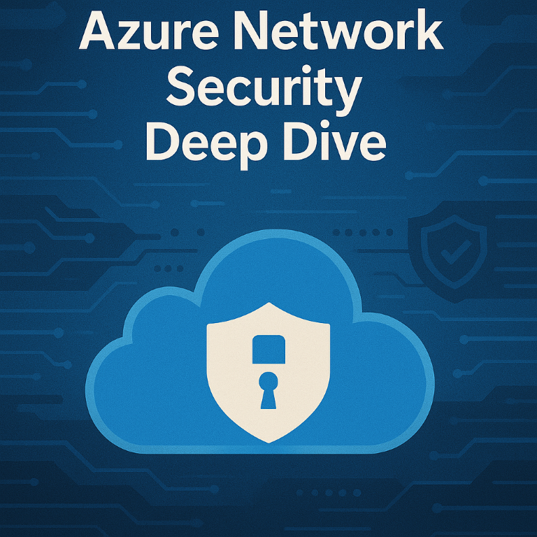

## Azure Network Security Deep Dive
### Day 1
[Azure geographies](https://azure.microsoft.com/explore/global-infrastructure/geographies/?WT.mc_id=AZ-MVP-5002880#overview)\
[Azure global infrastructure experience](https://datacenters.microsoft.com/globe/explore?WT.mc_id=AZ-MVP-5002880)\
[Azure Network Security overview](https://learn.microsoft.com/azure/security/fundamentals/network-overview?WT.mc_id=AZ-MVP-5002880)\
[Find the Networking product you need](https://azure.microsoft.com/products/category/networking?WT.mc_id=AZ-MVP-5002880)\
[Zero Trust Model](https://www.microsoft.com/security/business/zero-trust?WT.mc_id=AZ-MVP-5002880)\
[What is Zero Trust?](https://learn.microsoft.com/security/zero-trust/zero-trust-overview?WT.mc_id=AZ-MVP-5002880)\
[Azure network security](https://azure.microsoft.com/solutions/network-security/?WT.mc_id=AZ-MVP-5002880)\
[Overview of Azure Virtual Networks](https://learn.microsoft.com/azure/virtual-network/virtual-networks-overview?WT.mc_id=AZ-MVP-5002880)\
[Overview of Azure Virtual Network Manager](https://learn.microsoft.com/azure/virtual-network-manager/overview?WT.mc_id=AZ-MVP-5002880)\
[Integrate Azure services with virtual networks for network isolation](https://learn.microsoft.com/azure/virtual-network/vnet-integration-for-azure-services?WT.mc_id=AZ-MVP-5002880)\
[Virtual Network Peering](https://learn.microsoft.com/azure/virtual-network/virtual-network-peering-overview?WT.mc_id=AZ-MVP-5002880)\
[Network Security Groups (NSGs)](https://learn.microsoft.com/azure/virtual-network/network-security-groups-overview?WT.mc_id=AZ-MVP-5002880)\
[Application Security Groups (ASGs)](https://learn.microsoft.com/azure/virtual-network/application-security-groups?WT.mc_id=AZ-MVP-5002880)\
[Understand just-in-time VM access](https://learn.microsoft.com/training/modules/azure-security-center/15-understand-just-in-time-vm-access/?WT.mc_id=AZ-MVP-5002880)\
[Virtual network service tags](https://learn.microsoft.com/azure/virtual-network/service-tags-overview?WT.mc_id=AZ-MVP-5002880)\
[Azure Virtual Networks - Service endpoints](https://learn.microsoft.com/azure/virtual-network/virtual-network-service-endpoints-overview?WT.mc_id=AZ-MVP-5002880)\
[Azure Virtual Network traffic routing](https://learn.microsoft.com/azure/virtual-network/virtual-networks-udr-overview?WT.mc_id=AZ-MVP-5002880)\
[Training: Introduction to Azure Virtual Networks | Unit 9](https://learn.microsoft.com/training/modules/introduction-to-azure-virtual-networks/9-implement-virtual-network-traffic-routing/?WT.mc_id=AZ-MVP-5002880)\
[What is Azure Bastion?](https://learn.microsoft.com/azure/bastion/bastion-overview?WT.mc_id=AZ-MVP-5002880)\
[What is Azure Web Application Firewall (WAF)\?](https://learn.microsoft.com/azure/web-application-firewall/overview?WT.mc_id=AZ-MVP-5002880)\
[What is Azure Application Gateway?](https://learn.microsoft.com/azure/application-gateway/overview?WT.mc_id=AZ-MVP-5002880)\
[Azure Front Door](https://learn.microsoft.com/azure/frontdoor/front-door-overview?WT.mc_id=AZ-MVP-5002880)\
[Azure Web Application Firewall on Azure Front Door](https://learn.microsoft.com/azure/web-application-firewall/afds/afds-overview?WT.mc_id=AZ-MVP-5002880)

### Day 2
[Azure VPN Gateway](https://learn.microsoft.com/azure/vpn-gateway/vpn-gateway-about-vpngateways?WT.mc_id=AZ-MVP-5002880)\
[Azure ExpressRoute](https://learn.microsoft.com/azure/expressroute/expressroute-introduction?WT.mc_id=AZ-MVP-5002880)\
[ExpressRoute connectivity models](https://learn.microsoft.com/azure/expressroute/expressroute-connectivity-models?WT.mc_id=AZ-MVP-5002880)\
[Azure Private Link](https://learn.microsoft.com/azure/private-link/private-link-overview?WT.mc_id=AZ-MVP-5002880)\
[Azure encryption overview](https://learn.microsoft.com/azure/security/fundamentals/encryption-overview?WT.mc_id=AZ-MVP-5002880)\
[Azure Storage encryption for data at rest](https://learn.microsoft.com/azure/storage/common/storage-service-encryption?toc=%2Fazure%2Fstorage%2Fblobs%2Ftoc.json&bc=%2Fazure%2Fstorage%2Fblobs%2Fbreadcrumb%2Ftoc.json&WT.mc_id=AZ-MVP-5002880)\
[Grant limited access to Azure Storage resources using shared access signatures (SAS)](https://learn.microsoft.com/azure/storage/common/storage-sas-overview?toc=%2Fazure%2Fstorage%2Fblobs%2Ftoc.json&bc=%2Fazure%2Fstorage%2Fblobs%2Fbreadcrumb%2Ftoc.json&WT.mc_id=AZ-MVP-5002880)\
[Azure Load-balancing options](https://learn.microsoft.com/azure/architecture/guide/technology-choices/load-balancing-overview?WT.mc_id=AZ-MVP-5002880)\
[Azure Load Balancer](https://learn.microsoft.com/azure/load-balancer/load-balancer-overview?WT.mc_id=AZ-MVP-5002880)\
[Azure Traffic Manager](https://learn.microsoft.com/azure/traffic-manager/traffic-manager-overview?WT.mc_id=AZ-MVP-5002880)\
[Azure DNS service](https://learn.microsoft.com/azure/dns/dns-overview?WT.mc_id=AZ-MVP-5002880)\
[Perimeter networks | Cloud Adoption Framework](https://learn.microsoft.com/azure/cloud-adoption-framework/ready/azure-best-practices/perimeter-networks?WT.mc_id=AZ-MVP-5002880)\
[Azure Distributed denial of service (DDoS) Protection](https://learn.microsoft.com/azure/ddos-protection/ddos-protection-overview?WT.mc_id=AZ-MVP-5002880)\
[Azure Front Door](https://learn.microsoft.com/azure/frontdoor/front-door-overview?WT.mc_id=AZ-MVP-5002880)\
[Azure Web Application Firewall on Azure Front Door](https://learn.microsoft.com/azure/web-application-firewall/afds/afds-overview?WT.mc_id=AZ-MVP-5002880)\
[Azure Network Watcher](https://learn.microsoft.com/azure/network-watcher/network-watcher-monitoring-overview)\
[Flow logs for network security groups](https://learn.microsoft.com/azure/network-watcher/network-watcher-nsg-flow-logging-overview?WT.mc_id=AZ-MVP-5002880)\
[Azure best practices for network security](https://learn.microsoft.com/azure/security/fundamentals/network-best-practices?WT.mc_id=AZ-MVP-5002880)\
[Microsoft Defender for Cloud](https://www.microsoft.com/security/business/cloud-security/microsoft-defender-cloud?WT.mc_id=AZ-MVP-5002880)\
[Microsoft Defender for Cloud (Technical Documentation)](https://learn.microsoft.com/azure/defender-for-cloud/defender-for-cloud-introduction?WT.mc_id=AZ-MVP-5002880)\
[Protect Cloud Workloads](https://learn.microsoft.com/azure/defender-for-cloud/defender-for-cloud-introduction?WT.mc_id=AZ-MVP-5002880#protect-cloud-workloads)\
[Microsoft Defender - Secure Score (Introduction)](https://learn.microsoft.com/azure/defender-for-cloud/secure-score-security-controls?WT.mc_id=AZ-MVP-5002880#introduction-to-secure-score)\
[Azure Secure Score vs. Microsoft Secure Score](https://techcommunity.microsoft.com/t5/microsoft-defender-for-cloud/azure-secure-score-vs-microsoft-secure-score/ba-p/2459684?WT.mc_id=AZ-MVP-5002880)\
[Power BI Dashboard - Secure Score (GitHub)](https://github.com/Azure/Azure-Security-Center/tree/master/Secure%20Score?WT.mc_id=AZ-MVP-5002880)\
[Cloud Security Posture Management (CSPM)](https://learn.microsoft.com/azure/defender-for-cloud/concept-cloud-security-posture-management?WT.mc_id=AZ-MVP-5002880)\
[Virtual Network Terminal Access Point (TAP) - Preview](https://learn.microsoft.com/azure/virtual-network/virtual-network-tap-overview?WT.mc_id=AZ-MVP-5002880)

### Additional trainings, certification info, frameworks, tools
[Microsoft Certified: Azure Network Engineer Associate](https://learn.microsoft.com/certifications/azure-network-engineer-associate/?WT.mc_id=AZ-MVP-5002880)\
[Introduction to Azure Virtual Networks | Microsoft Learn Training](https://learn.microsoft.com/training/modules/introduction-to-azure-virtual-networks/)\
[AZ-700 Designing and Implementing Microsoft Azure Networking Solutions | Microsoft Learn](https://learn.microsoft.com/training/paths/design-implement-microsoft-azure-networking-solutions-az-700/?WT.mc_id=AZ-MVP-5002880)\
[Azure Network Security Ninja Training](https://techcommunity.microsoft.com/t5/azure-network-security-blog/azure-network-security-ninja-training/ba-p/2356101?WT.mc_id=AZ-MVP-5002880)\
[Microsoft Certified: Azure Administrator Associate](https://learn.microsoft.com/certifications/azure-administrator/?WT.mc_id=AZ-MVP-5002880)\
[Microsoft Certified: Azure Security Engineer Associate](https://learn.microsoft.com/certifications/azure-security-engineer/?WT.mc_id=AZ-MVP-5002880)\
[Cloud Adoption Framework - Trainings (Microsoft Learn)](https://learn.microsoft.com/training/modules/microsoft-cloud-adoption-framework-for-azure?WT.mc_id=AZ-MVP-5002880)\
[Cloud Adoption Framework - All learning paths](https://learn.microsoft.com/training/paths/cloud-adoption-framework?WT.mc_id=AZ-MVP-5002880)\
[Cloud Adoption Framework - Overview](https://docs.microsoft.com/azure/cloud-adoption-framework/overview?WT.mc_id=AZ-MVP-5002880)\
[Azure Architecture Documentation](https://learn.microsoft.com/azure/architecture?WT.mc_id=AZ-MVP-5002880)