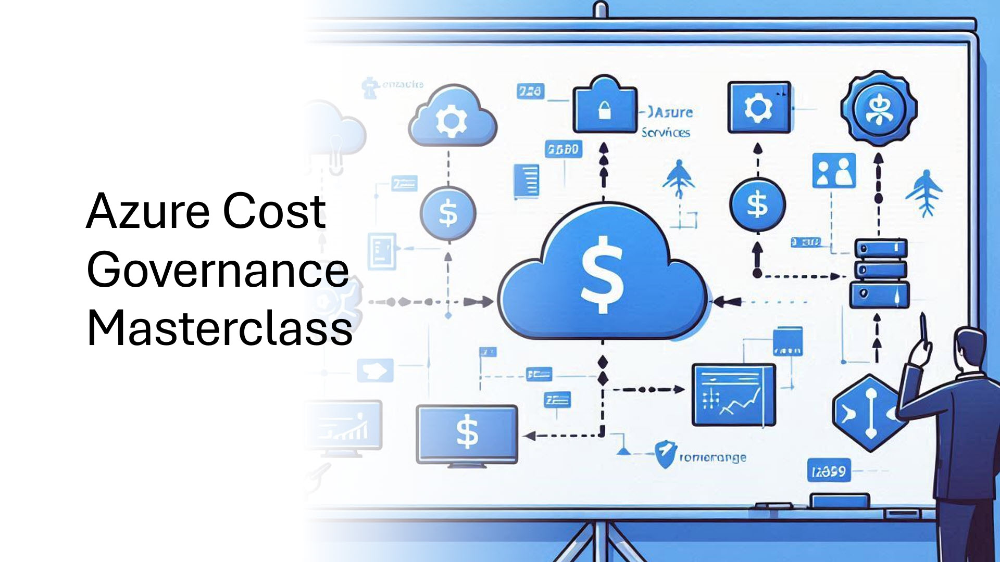

## Day 1
### Chapter 1: Introduction to FinOps
[What is Azure FinOps?](https://learn.microsoft.com/cloud-computing/finops/overview?WT.mc_id=AZ-MVP-5002880)\
[FinOps Framework](https://www.finops.org/framework/)\
[FinOps Principles](https://learn.microsoft.com/cloud-computing/finops/framework/finops-framework?WT.mc_id=AZ-MVP-5002880#principles)\
[Who is involved?](https://www.finops.org/framework/personas/)\
[FinOps Personas/Stakeholders](https://www.finops.org/framework/personas/)\
[FinOps Capabilities](https://learn.microsoft.com/en-us/cloud-computing/finops/framework/capabilities?WT.mc_id=AZ-MVP-5002880)\
[FinOps Phases](https://www.finops.org/framework/phases/)\
[Maturity Model](https://www.finops.org/framework/maturity-model/)\
[The Cloud Adoption journey](https://azure.microsoft.com/solutions/cloud-enablement/cloud-adoption-framework/?WT.mc_id=AZ-MVP-5002880#cloud-adoption-journey)\
[Microsoft Cloud Adoption Framework for Azure](https://learn.microsoft.com/azure/cloud-adoption-framework/overview?WT.mc_id=AZ-MVP-5002880)\
[Cloud adoption in the era of accelerated Digital Transformation (Article)](https://www.ituziast.com/index.php/2020/04/17/cloud-adoption-in-the-era-of-accelerated-digital-transformation-part-1/)\
[Azure Well-Architected Framework](https://learn.microsoft.com/azure/architecture/framework?WT.mc_id=AZ-MVP-5002880)\
[Azure subscription and service limits, quotas, and constraints](https://learn.microsoft.com/azure/azure-resource-manager/management/azure-subscription-service-limits?WT.mc_id=AZ-MVP-5002880)
### Chapter 2: Understanding Azure usage, billing and costs
[Understand cloud usage and cost](https://learn.microsoft.com/en-us/cloud-computing/finops/framework/understand/understand-cloud-usage-cost)\
[Data ingestion](https://learn.microsoft.com/cloud-computing/finops/framework/understand/ingestion?WT.mc_id=AZ-MVP-5002880)\
[FinOps Open Cost and Usage Specification (FOCUS)](https://learn.microsoft.com/en-us/cloud-computing/finops/focus/what-is-focus?WT.mc_id=AZ-MVP-5002880)\
[Cost Allocation](https://learn.microsoft.com/cloud-computing/finops/framework/understand/allocation?WT.mc_id=AZ-MVP-5002880)\
[Reporting/Analytics](https://learn.microsoft.com/cloud-computing/finops/framework/understand/reporting?WT.mc_id=AZ-MVP-5002880)\
[Anomalies](https://learn.microsoft.com/cloud-computing/finops/framework/understand/anomalies?WT.mc_id=AZ-MVP-5002880)\
[Understanding Azure Billing Structure](https://learn.microsoft.com/azure/cost-management-billing/costs/cost-allocation-introduction?WT.mc_id=AZ-MVP-5002880)\
[Best practices for costing and sizing resources hosted in Azure](https://learn.microsoft.com/azure/cloud-adoption-framework/govern/cost-management/best-practices?WT.mc_id=AZ-MVP-5002880)\
[Azure subscription and service limits, quotas, and constraints](https://learn.microsoft.com/azure/azure-resource-manager/management/azure-subscription-service-limits?WT.mc_id=AZ-MVP-5002880)
### Chapter 3: Cost Monitoring and Control with Azure Tools
[Microsoft Cost Management](https://learn.microsoft.com/azure/cost-management-billing/costs/overview-cost-management?WT.mc_id=AZ-MVP-5002880)\
[FinOps Toolkit](https://learn.microsoft.com/en-us/cloud-computing/finops/toolkit/finops-toolkit-overview?WT.mc_id=AZ-MVP-5002880)\
[FinOps Hub](https://microsoft.github.io/finops-toolkit)\
[Fabric Workspace for FinOps](https://learn.microsoft.com/en-us/cloud-computing/finops/fabric/create-fabric-workspace-finops?WT.mc_id=AZ-MVP-5002880)\
[Azure Pricing Calculator](https://azure.microsoft.com/en-us/pricing/calculator?WT.mc_id=AZ-MVP-5002880)\
[Cost Optimization practices](https://learn.microsoft.com/azure/cost-management-billing/costs/cost-mgt-best-practices?WT.mc_id=AZ-MVP-5002880#act-to-optimize)\
[Subscription considerations and recommendations](https://learn.microsoft.com/azure/cloud-adoption-framework/ready/landing-zone/design-area/resource-org-subscriptions?WT.mc_id=AZ-MVP-5002880)\
[Resource naming and tagging decision guide](https://learn.microsoft.com/azure/cloud-adoption-framework/ready/azure-best-practices/resource-naming-and-tagging-decision-guide?WT.mc_id=AZ-MVP-5002880)\
[Define your tagging strategy](https://learn.microsoft.com/azure/cloud-adoption-framework/ready/azure-best-practices/resource-tagging?WT.mc_id=AZ-MVP-5002880)\
[Resource naming and tagging decision guide](https://learn.microsoft.com/azure/cloud-adoption-framework/ready/azure-best-practices/resource-naming-and-tagging-decision-guide?WT.mc_id=AZ-MVP-5002880)\
### Chapter 4: Analyzing Spend and Defining Cost Constraints in Azure
[Use cost alerts to monitor usage and spending](https://learn.microsoft.com/en-us/azure/cost-management-billing/costs/cost-mgt-alerts-monitor-usage-spending?WT.mc_id=AZ-MVP-5002880)\
[Manage costs with budgets](https://learn.microsoft.com/azure/cost-management-billing/manage/cost-management-budget-scenario?WT.mc_id=AZ-MVP-5002880)\
[Cost Analysis Dashboard](https://learn.microsoft.com/en-us/azure/cost-management-billing/costs/quick-acm-cost-analysis?WT.mc_id=AZ-MVP-5002880)\
[Kubernetes costs](https://learn.microsoft.com/azure/cost-management-billing/costs/view-kubernetes-costs?WT.mc_id=AZ-MVP-5002880)\
[Microsoft Cost Management connector in Power BI Desktop](https://learn.microsoft.com/power-bi/connect-data/desktop-connect-azure-cost-management?WT.mc_id=AZ-MVP-5002880)
## Day 2
### Chapter 5: Optimization and Cost-Saving Techniques
[Cost optimization quick links | Azure Well-Architected Framework](https://learn.microsoft.com/azure/well-architected/cost-optimization/?WT.mc_id=AZ-MVP-5002880)\
[Azure management groups](https://learn.microsoft.com/azure/governance/management-groups/overview?WT.mc_id=AZ-MVP-5002880)\
[Azure Policy](https://learn.microsoft.com/azure/governance/policy/overview?WT.mc_id=AZ-MVP-5002880)\
[Policy enforcement decision guide](https://learn.microsoft.com/azure/cloud-adoption-framework/decision-guides/policy-enforcement?WT.mc_id=AZ-MVP-5002880)\
[Recommendations for setting spending guardrails](https://learn.microsoft.com/azure/well-architected/cost-optimization/set-spending-guardrails?WT.mc_id=AZ-MVP-5002880)
### Chapter 6: Cost optimization trough clean-up
[Azure Advisor](https://learn.microsoft.com/azure/advisor/advisor-overview?WT.mc_id=AZ-MVP-5002880)\
[Recommendations for optimizing scaling costs](https://learn.microsoft.com/en-us/azure/well-architected/cost-optimization/optimize-scaling-costs?WT.mc_id=AZ-MVP-5002880)\
[Recommendations for optimizing component costs](https://learn.microsoft.com/azure/well-architected/cost-optimization/optimize-component-costs?WT.mc_id=AZ-MVP-5002880)\
[Azure Reservations](https://learn.microsoft.com/azure/cost-management-billing/reservations/save-compute-costs-reservations?WT.mc_id=AZ-MVP-5002880)\
[Charges covered by reservation](https://learn.microsoft.com/en-us/azure/cost-management-billing/reservations/save-compute-costs-reservations?WT.mc_id=AZ-MVP-5002880#charges-covered-by-reservation)\
[Azure savings plans for compute](https://learn.microsoft.com/azure/cost-management-billing/savings-plan/savings-plan-compute-overview?WT.mc_id=AZ-MVP-5002880)\
[Decide between a savings plan and a reservation](https://learn.microsoft.com/azure/cost-management-billing/savings-plan/decide-between-savings-plan-reservation?WT.mc_id=AZ-MVP-5002880)
### Additional materials
[Azure FinOps Masterclass | Microsoft Learn Collection](https://learn.microsoft.com/en-us/collections/rq2db8wo0ox33e?&sharingId=AZ-MVP-5002880)\
[Azure FinOps: What it is and Why it matters (Article)](https://www.ituziast.com/index.php/2023/02/20/azure-finops-what-it-is-and-why-it-matters)\
[Cloud adoption in the era of accelerated Digital Transformation (Article)](https://www.ituziast.com/index.php/2020/04/17/cloud-adoption-in-the-era-of-accelerated-digital-transformation-part-1/)\
[Microsoft Assessments](https://learn.microsoft.com/assessments?WT.mc_id=AZ-MVP-5002880)\
[CAF Tools and templates](https://learn.microsoft.com/azure/cloud-adoption-framework/resources/tools-templates?WT.mc_id=AZ-MVP-5002880)\
[Organizational alignment](https://learn.microsoft.com/azure/cloud-adoption-framework/organize?WT.mc_id=AZ-MVP-5002880)\
[Training: Accelerate cloud adoption with the Microsoft Cloud Adoption Framework for Azure](https://learn.microsoft.com/training/paths/cloud-adoption-framework?WT.mc_id=AZ-MVP-5002880)\
[Three areas of focus to achieve Azure operational efficiency (Article)](https://www.ituziast.com/index.php/2024/03/08/three-areas-of-focus-to-achieve-azure-operational-efficiency)