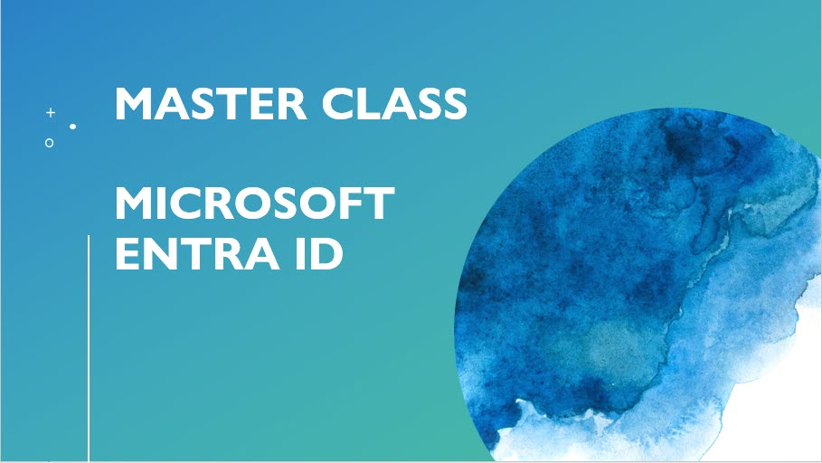

### Frameworks

[Microsoft Azure Cloud Adoption Framework - Overview](https://learn.microsoft.com/azure/cloud-adoption-framework/overview?WT.mc_id=AZ-MVP-5002880)\
[Microsoft Azure Well-Architected Framework](https://learn.microsoft.com/azure/well-architected/?WT.mc_id=AZ-MVP-5002880)\
[Microsoft Cyber Security Reference Architecture (MCRA)](https://learn.microsoft.com/security/adoption/mcra?WT.mc_id=AZ-MVP-5002880)\
[Microsoft Zero Trust Model](https://www.microsoft.com/security/business/zero-trust?WT.mc_id=AZ-MVP-5002880)\
[Zero Trust Guidance Center](https://learn.microsoft.com/security/zero-trust/zero-trust-overview?WT.mc_id=AZ-MVP-5002880)

### Module 1: Introduction to Microsoft Entra ID
[Zero Trust deployment for technology pillars](https://learn.microsoft.com/security/zero-trust/deploy/overview?WT.mc_id=AZ-MVP-5002880)\
[Enforce cloud governance policies](https://learn.microsoft.com/azure/cloud-adoption-framework/govern/enforce-cloud-governance-policies?WT.mc_id=AZ-MVP-5002880)\
[Security quick links](https://learn.microsoft.com/azure/well-architected/security/?WT.mc_id=AZ-MVP-5002880)\
[Recommendations for identity and access management](https://learn.microsoft.com/azure/well-architected/security/identity-access?WT.mc_id=AZ-MVP-5002880)\
[What is Microsoft Entra ID?](https://learn.microsoft.com/entra/fundamentals/whatis?WT.mc_id=AZ-MVP-5002880)\
[Discuss identity management solutions | Explore identity in Microsoft Entra ID | Microsoft Learn module](https://learn.microsoft.com/en-us/training/modules\explore-identity-azure-active-directory/8-discuss-identity-management-solutions)\
[What is Azure Active Directory B2C?](https://learn.microsoft.com/azure/active-directory-b2c/overview?WT.mc_id=AZ-MVP-5002880)
[Introduction to Microsoft Entra External ID](https://learn.microsoft.com/entra/external-id/external-identities-overview?WT.mc_id=AZ-MVP-5002880)\
[Define identity administration | Explore identity in Microsoft Entra ID | Microsoft Learn module](https://learn.microsoft.com/en-us/training/modules/explore-identity-azure-active-directory/6-define-identity-administration?WT.mc_id=AZ-MVP-5002880)\
[Compare Microsoft Entra ID and Active Directory Domain Services | Understand Microsoft Entra ID | Microsoft Learn module](https://learn.microsoft.com/en-us/training/modules/understand-azure-active-directory/3-compare-azure-active-directory-domain-services?WT.mc_id=AZ-MVP-5002880)\
[Compare Active Directory to Microsoft Entra ID](https://learn.microsoft.com/entra/fundamentals/compare?WT.mc_id=AZ-MVP-5002880)\
[Explore authentication | Explore identity in Microsoft Entra ID | Microsoft Learn module](https://learn.microsoft.com/en-us/training/modules/explore-identity-azure-active-directory/12-explore-authentication?WT.mc_id=AZ-MVP-5002880)\
[Discuss authorization | Explore identity in Microsoft Entra ID | Microsoft Learn module](https://learn.microsoft.com/en-us/training/modules/explore-identity-azure-active-directory/13-discuss-authorization?WT.mc_id=AZ-MVP-5002880)\
[Microsoft Entra ID Plans and Pricing](https://www.microsoft.com/en/security/business/microsoft-entra-pricing?WT.mc_id=AZ-MVP-5002880)\
[Compare Microsoft Entra ID P1 and P2 plans | Understand Microsoft Entra ID | Microsoft Learn module](https://learn.microsoft.com/en-us/training/modules/understand-azure-active-directory/5-compare-azure-premium-p1-p2-plans?WT.mc_id=AZ-MVP-5002880)\
[Pricing structure and billing model for Microsoft Entra External ID](https://learn.microsoft.com/en-us/entra/external-id/external-identities-pricing?WT.mc_id=AZ-MVP-5002880)\
[Configure your company branding](https://learn.microsoft.com/entra/fundamentals/how-to-customize-branding?WT.mc_id=AZ-MVP-5002880)\
[Microsoft Entra built-in roles](https://learn.microsoft.com/entra/identity/role-based-access-control/permissions-reference?WT.mc_id=AZ-MVP-5002880)\
[Azure roles, Microsoft Entra roles, and classic subscription administrator roles](https://learn.microsoft.com/azure/role-based-access-control/rbac-and-directory-admin-roles?WT.mc_id=AZ-MVP-5002880)\
[Create a custom role in Microsoft Entra ID](https://learn.microsoft.com/entra/identity/role-based-access-control/custom-create?WT.mc_id=AZ-MVP-5002880)\
[Create custom roles to manage enterprise apps in Microsoft Entra ID](https://learn.microsoft.com/entra/identity/role-based-access-control/custom-enterprise-apps?WT.mc_id=AZ-MVP-5002880)\
[Assign Microsoft Entra roles](https://learn.microsoft.com/entra/identity/role-based-access-control/manage-roles-portal?WT.mc_id=AZ-MVP-5002880)\
[Create a role-assignable group in Microsoft Entra ID](https://learn.microsoft.com/entra/identity/role-based-access-control/groups-create-eligible?WT.mc_id=AZ-MVP-5002880)\
[Delegate app registration permissions in Microsoft Entra ID](https://learn.microsoft.com/entra/identity/role-based-access-control/delegate-app-roles?WT.mc_id=AZ-MVP-5002880)\
[Administrative Units](https://learn.microsoft.com/entra/identity/role-based-access-control/administrative-units?WT.mc_id=AZ-MVP-5002880)\
[Privileged roles and permissions in Microsoft Entra ID (preview)](https://learn.microsoft.com/entra/identity/role-based-access-control/privileged-roles-permissions?WT.mc_id=AZ-MVP-5002880)
### Module 2: Identity Management
[Identity administration concepts | Explore identity in Microsoft Entra ID | Microsoft Learn module](https://learn.microsoft.com/en-us/training/modules/explore-identity-azure-active-directory/5-explore-why-have-identity?WT.mc_id=AZ-MVP-5002880)\
[Contrast decentralized identity with central identity systems | Explore identity in Microsoft Entra ID | Microsoft Learn module](https://learn.microsoft.com/en-us/training/modules/explore-identity-azure-active-directory/7-contrast-decentralized-identity-central-identity-systems?WT.mc_id=AZ-MVP-5002880)\
[Microsoft Entra Verified ID](https://learn.microsoft.com/entra/verified-id/decentralized-identifier-overview?WT.mc_id=AZ-MVP-5002880)\
[How to create, invite, and delete users](https://learn.microsoft.com/entra/fundamentals/how-to-create-delete-users?toc=%2Fentra%2Fidentity%2Fusers%2Ftoc.json&bc=%2Fentra%2Fidentity%2Fusers%2Fbreadcrumb%2Ftoc.json&WT.mc_id=AZ-MVP-5002880)
[Group types, membership types, and access management](https://learn.microsoft.com/entra/fundamentals/concept-learn-about-groups?toc=%2Fentra%2Fidentity%2Fusers%2Ftoc.json&bc=%2Fentra%2Fidentity%2Fusers%2Fbreadcrumb%2Ftoc.json&WT.mc_id=AZ-MVP-5002880)\
[Understand and manage dynamic group processing in Microsoft Entra ID](https://learn.microsoft.com/entra/identity/users/manage-dynamic-group?WT.mc_id=AZ-MVP-5002880)\
[What is a device identity?](https://learn.microsoft.com/entra/identity/devices/overview?WT.mc_id=AZ-MVP-5002880)\
[Microsoft Entra registered devices](https://learn.microsoft.com/entra/identity/devices/concept-device-registration?WT.mc_id=AZ-MVP-5002880)\
[Microsoft Entra joined devices](https://learn.microsoft.com/entra/identity/devices/concept-directory-join?WT.mc_id=AZ-MVP-5002880)\
[Microsoft Entra hybrid joined devices](https://learn.microsoft.com/entra/identity/devices/concept-hybrid-join?WT.mc_id=AZ-MVP-5002880)\
[What is group-based licensing in Microsoft Entra ID?](https://learn.microsoft.com/entra/fundamentals/concept-group-based-licensing?WT.mc_id=AZ-MVP-5002880)\
[What are custom security attributes in Microsoft Entra ID?](https://learn.microsoft.com/entra/fundamentals/custom-security-attributes-overview?WT.mc_id=AZ-MVP-5002880)\
[Workforce and external tenant configurations in Microsoft Entra External ID](https://learn.microsoft.com/entra/external-id/tenant-configurations?WT.mc_id=AZ-MVP-5002880)\
[IT Admins - Overview of external collaboration options in Microsoft 365](https://learn.microsoft.com/microsoft-365/enterprise/external-guest-access?view=o365-worldwide&WT.mc_id=AZ-MVP-5002880)\
[Cross-tenant access with Microsoft Entra External ID](https://learn.microsoft.com/entra/external-id/cross-tenant-access-overview?WT.mc_id=AZ-MVP-5002880)\
[Identity providers for External ID in workforce tenants](https://learn.microsoft.com/entra/external-id/identity-providers?WT.mc_id=AZ-MVP-5002880)\
[SAML/WS-Fed identity providers](https://learn.microsoft.com/entra/external-id/direct-federation-overview?WT.mc_id=AZ-MVP-5002880)\
[What is entitlement management?](https://learn.microsoft.com/entra/id-governance/entitlement-management-overview?WT.mc_id=AZ-MVP-5002880)\
[Common scenarios in entitlement management](https://learn.microsoft.com/entra/id-governance/entitlement-management-scenarios?WT.mc_id=AZ-MVP-5002880)\
[Manage connected organizations in entitlement management](https://learn.microsoft.com/entra/id-governance/entitlement-management-organization?WT.mc_id=AZ-MVP-5002880)\
[Create and manage a catalog of resources in entitlement management](https://learn.microsoft.com/entra/id-governance/entitlement-management-catalog-create?WT.mc_id=AZ-MVP-5002880)\
[Create an access package in entitlement management](https://learn.microsoft.com/entra/id-governance/entitlement-management-access-package-create?WT.mc_id=AZ-MVP-5002880)\
[Delegate access governance to catalog creators in entitlement management](https://learn.microsoft.com/entra/id-governance/entitlement-management-delegate-catalog?WT.mc_id=AZ-MVP-5002880)\
[Delegate access governance to access package managers in entitlement management](https://learn.microsoft.com/entra/id-governance/entitlement-management-delegate-managers?WT.mc_id=AZ-MVP-5002880#as-a-catalog-owner-delegate-to-an-access-package-manager)\
[Approve or deny access requests in entitlement management](https://learn.microsoft.com/entra/id-governance/entitlement-management-request-approve?WT.mc_id=AZ-MVP-5002880)\
[Working with the Microsoft Entra entitlement management API](https://learn.microsoft.com/entra/id-governance/entitlement-management-request-approve?WT.mc_id=AZ-MVP-5002880)
### Module 3: Security Enhancement in Microsoft Entra ID
[Microsoft Entra self-service password reset](https://learn.microsoft.com/entra/identity/authentication/concept-sspr-howitworks?WT.mc_id=AZ-MVP-5002880)\
[Plan a Microsoft Entra self-service password reset deployment](https://learn.microsoft.com/entra/identity/authentication/concept-sspr-deploy?WT.mc_id=AZ-MVP-5002880)\
[Licensing requirements for Microsoft Entra self-service password reset](https://learn.microsoft.com/entra/identity/authentication/concept-sspr-licensing?WT.mc_id=AZ-MVP-5002880)\
[Reporting options for Microsoft Entra password management](https://learn.microsoft.com/entra/identity/authentication/howto-sspr-reporting?WT.mc_id=AZ-MVP-5002880)\
[Microsoft Entra multifactor authentication (MFA)](https://learn.microsoft.com/entra/identity/authentication/concept-mfa-howitworks?WT.mc_id=AZ-MVP-5002880)\
[MFA Reports](https://learn.microsoft.com/entra/identity/authentication/howto-mfa-reporting?WT.mc_id=AZ-MVP-5002880)\
[PowerShell reporting on users registered for MFA](https://learn.microsoft.com/en-us/entra/identity/authentication/howto-mfa-reporting?WT.mc_id=AZ-MVP-5002880#powershell-reporting-on-users-registered-for-mfa)
[Microsoft Entra user data collection for multifactor authentication and self-service password reset](https://learn.microsoft.com/entra/identity/authentication/howto-mfa-reporting-datacollection?WT.mc_id=AZ-MVP-5002880)
[What authentication and verification methods are available in Microsoft Entra ID?](https://learn.microsoft.com/entra/identity/authentication/concept-authentication-methods?WT.mc_id=AZ-MVP-5002880)\
[Passwordless authentication options for Microsoft Entra ID](https://learn.microsoft.com/entra/identity/authentication/concept-authentication-passwordless?WT.mc_id=AZ-MVP-5002880)\
[Authentication methods in Microsoft Entra ID - Microsoft Authenticator app](https://learn.microsoft.com/entra/identity/authentication/concept-authentication-authenticator-app?WT.mc_id=AZ-MVP-5002880)\
[Authentication methods in Microsoft Entra ID - OATH tokens](https://learn.microsoft.com/entra/identity/authentication/concept-authentication-oath-tokens?WT.mc_id=AZ-MVP-5002880)\
[Windows Hello for Business](https://learn.microsoft.com/entra/identity/authentication/concept-authentication-passwordless?WT.mc_id=AZ-MVP-5002880#windows-hello-for-business)\
[Revoke user access in Microsoft Entra ID](https://learn.microsoft.com/entra/identity/users/users-revoke-access?WT.mc_id=AZ-MVP-5002880)\
[Plan and deploy on-premises Microsoft Entra Password Protection](https://learn.microsoft.com/entra/identity/authentication/howto-password-ban-bad-on-premises-deploy?WT.mc_id=AZ-MVP-5002880)\
[Protect user accounts from attacks with Microsoft Entra smart lockout](https://learn.microsoft.com/entra/identity/authentication/howto-password-smart-lockout?WT.mc_id=AZ-MVP-5002880)\
[Kerberos Constrained Delegation for single sign-on (SSO) to your apps with application proxy](https://learn.microsoft.com/entra/identity/app-proxy/how-to-configure-sso-with-kcd?WT.mc_id=AZ-MVP-5002880)\
[Overview of Microsoft Entra certificate-based authentication (CBA)](https://learn.microsoft.com/entra/identity/authentication/concept-certificate-based-authentication?WT.mc_id=AZ-MVP-5002880)\
[Sign in to a Windows virtual machine in Azure by using Microsoft Entra ID including passwordless](https://learn.microsoft.com/entra/identity/devices/howto-vm-sign-in-azure-ad-windows?WT.mc_id=AZ-MVP-5002880)\
[Sign in to a Linux virtual machine in Azure by using Microsoft Entra ID and OpenSSH](https://learn.microsoft.com/entra/identity/devices/howto-vm-sign-in-azure-ad-linux?WT.mc_id=AZ-MVP-5002880)\
[What is Conditional Access?](https://learn.microsoft.com/entra/identity/conditional-access/overview?WT.mc_id=AZ-MVP-5002880)\
[Plan a Conditional Access deployment](https://learn.microsoft.com/entra/identity/conditional-access/plan-conditional-access?WT.mc_id=AZ-MVP-5002880)\
[Building a Conditional Access policy](https://learn.microsoft.com/en-us/entra/identity/conditional-access/concept-conditional-access-policies)\
[Conditional Access policy templates](https://learn.microsoft.com/entra/identity/conditional-access/concept-conditional-access-policy-common?WT.mc_id=AZ-MVP-5002880)\
[Analyze Conditional Access Policy Impact](https://learn.microsoft.com/entra/identity/conditional-access/concept-conditional-access-report-only?view=graph-rest-1.0&WT.mc_id=AZ-MVP-5002880)\
[Troubleshoot sign-in problems with Conditional Access](https://learn.microsoft.com/entra/identity/conditional-access/troubleshoot-conditional-access?WT.mc_id=AZ-MVP-5002880)\
[Use audit logs to troubleshoot Conditional Access policy changes](https://learn.microsoft.com/entra/identity/conditional-access/troubleshoot-policy-changes-audit-log?WT.mc_id=AZ-MVP-5002880)\
[Troubleshooting Conditional Access using the What If tool](https://learn.microsoft.com/entra/identity/conditional-access/troubleshoot-conditional-access-what-if?WT.mc_id=AZ-MVP-5002880)\
[Conditional Access app control in Microsoft Defender for Cloud Apps](https://learn.microsoft.com/defender-cloud-apps/proxy-intro-aad?WT.mc_id=AZ-MVP-5002880)\
[Conditional Access: Session](https://learn.microsoft.com/entra/identity/conditional-access/concept-conditional-access-session?WT.mc_id=AZ-MVP-5002880)\
[Continuous access evaluation](https://learn.microsoft.com/entra/identity/conditional-access/concept-continuous-access-evaluation?WT.mc_id=AZ-MVP-5002880)\
[What is Microsoft Entra ID Protection?](https://learn.microsoft.com/entra/id-protection/overview-identity-protection?WT.mc_id=AZ-MVP-5002880)\
[What are risk detections?](https://learn.microsoft.com/entra/id-protection/concept-identity-protection-risks?WT.mc_id=AZ-MVP-5002880)\
[Risk-based access policies](https://learn.microsoft.com/entra/id-protection/concept-identity-protection-policies?WT.mc_id=AZ-MVP-5002880)\
[Microsoft Entra ID Protection - Roles](https://learn.microsoft.com/en-us/entra/id-protection/overview-identity-protection?WT.mc_id=AZ-MVP-5002880#required-roles)\
[Microsoft Entra ID Protection - License requirements](https://learn.microsoft.com/en-us/entra/id-protection/overview-identity-protection?WT.mc_id=AZ-MVP-5002880#license-requirements)\
[Implement User-risk policies](https://learn.microsoft.com/entra/id-protection/howto-identity-protection-configure-risk-policies?WT.mc_id=AZ-MVP-5002880#user-risk-policy-in-conditional-access)\
[How To: Investigate risk](https://learn.microsoft.com/entra/id-protection/howto-identity-protection-investigate-risk?WT.mc_id=AZ-MVP-5002880)\
[Remediate risks and unblock users](https://learn.microsoft.com/entra/id-protection/howto-identity-protection-remediate-unblock?WT.mc_id=AZ-MVP-5002880)\
[How To: Export risk data](https://learn.microsoft.com/entra/id-protection/howto-export-risk-data?WT.mc_id=AZ-MVP-5002880)\
[Microsoft Entra ID Protection and the Microsoft Graph PowerShell](https://learn.microsoft.com/entra/id-protection/howto-identity-protection-graph-api?WT.mc_id=AZ-MVP-5002880)\
[Overview of identity protection APIs in Microsoft Graph](https://learn.microsoft.com/graph/api/resources/identityprotection-overview?view=graph-rest-1.0&WT.mc_id=AZ-MVP-5002880)\
[Securing workload identities](https://learn.microsoft.com/entra/id-protection/concept-workload-identity-risk?WT.mc_id=AZ-MVP-5002880)\
[What is Microsoft Defender for Identity?](https://learn.microsoft.com/defender-for-identity/what-is?WT.mc_id=AZ-MVP-5002880)\
[Implement access management for Azure resources](https://learn.microsoft.com/en-us/training/modules/implement-access-management-for-azure-resources/?WT.mc_id=AZ-MVP-5002880)\
[What are managed identities for Azure resources?](https://learn.microsoft.com/entra/identity/managed-identities-azure-resources/overview?WT.mc_id=AZ-MVP-5002880)\
[Managed Identity Types](https://learn.microsoft.com/entra/identity/managed-identities-azure-resources/overview?WT.mc_id=AZ-MVP-5002880#managed-identity-types)\
[Differences between system-assigned and user-assigned managed identities](https://learn.microsoft.com/en-us/entra/identity/managed-identities-azure-resources/overview?WT.mc_id=AZ-MVP-5002880#differences-between-system-assigned-and-user-assigned-managed-identities)\
[Connecting from your application to resources without handling credentials](https://learn.microsoft.com/entra/identity/managed-identities-azure-resources/overview-for-developers?WT.mc_id=AZ-MVP-5002880)\
[Managed identity best practice recommendations](https://learn.microsoft.com/entra/identity/managed-identities-azure-resources/managed-identity-best-practice-recommendations?WT.mc_id=AZ-MVP-5002880)\
[Provide access to Key Vault keys, certificates, and secrets with Azure role-based access control](https://learn.microsoft.com/azure/key-vault/general/rbac-guide?WT.mc_id=AZ-MVP-5002880)\
[Best practices for using Azure Key Vault](https://learn.microsoft.com/azure/key-vault/general/best-practices?WT.mc_id=AZ-MVP-5002880)\
[Azure built-in roles for Key Vault data plane operations](https://learn.microsoft.com/azure/key-vault/general/rbac-guide?tabs=azure-cli&WT.mc_id=AZ-MVP-5002880#azure-built-in-roles-for-key-vault-data-plane-operations)\
[Troubleshooting Azure Key Vault access policy issues](https://learn.microsoft.com/azure/key-vault/general/troubleshooting-access-issues?WT.mc_id=AZ-MVP-5002880)\
[What is Microsoft Entra Privileged Identity Management?](https://learn.microsoft.com/entra/id-governance/privileged-identity-management/pim-configure?WT.mc_id=AZ-MVP-5002880)\
[Microsoft Entra ID Governance licensing fundamentals](https://learn.microsoft.com/entra/id-governance/licensing-fundamentals?WT.mc_id=AZ-MVP-5002880)\
[Microsoft Entra ID Governance licensing for guest users](https://learn.microsoft.com/entra/id-governance/microsoft-entra-id-governance-licensing-for-guest-users?WT.mc_id=AZ-MVP-5002880)\
[Plan and implement privileged access](https://learn.microsoft.com/en-us/training/modules/plan-implement-privileged-access/?WT.mc_id=AZ-MVP-5002880)\
[Get started with privileged access management](https://learn.microsoft.com/purview/privileged-access-management-configuration?WT.mc_id=AZ-MVP-5002880)\
[Activate a Microsoft Entra role in PIM](https://learn.microsoft.com/entra/id-governance/privileged-identity-management/pim-how-to-activate-role?WT.mc_id=AZ-MVP-5002880)\
[Activate your group membership or ownership in Privileged Identity Management](https://learn.microsoft.com/entra/id-governance/privileged-identity-management/groups-activate-roles?WT.mc_id=AZ-MVP-5002880)\
[Activate my Azure resource roles in Privileged Identity Management](https://learn.microsoft.com/entra/id-governance/privileged-identity-management/pim-resource-roles-activate-your-roles?WT.mc_id=AZ-MVP-5002880)\
[Manage emergency access accounts in Microsoft Entra ID](https://learn.microsoft.com/entra/identity/role-based-access-control/security-emergency-access?WT.mc_id=AZ-MVP-5002880)\
[Plan a Microsoft Entra access reviews deployment](https://learn.microsoft.com/entra/id-governance/deploy-access-reviews?WT.mc_id=AZ-MVP-5002880)\
[Who will create and manage access reviews?](https://learn.microsoft.com/en-us/entra/id-governance/deploy-access-reviews?WT.mc_id=AZ-MVP-5002880#who-will-create-and-manage-access-reviews)\
[Components of an access review](https://learn.microsoft.com/en-us/entra/id-governance/deploy-access-reviews?WT.mc_id=AZ-MVP-5002880#components-of-an-access-review)\
[Plan communications](https://learn.microsoft.com/entra/id-governance/deploy-access-reviews?WT.mc_id=AZ-MVP-5002880#plan-communications)\
[Prepare for an access review of users' access to an application](https://learn.microsoft.com/entra/id-governance/access-reviews-application-preparation?WT.mc_id=AZ-MVP-5002880)\
[Overview of access reviews Graph APIs](https://learn.microsoft.com/graph/api/resources/accessreviewsv2-overview?view=graph-rest-1.0&WT.mc_id=AZ-MVP-5002880)\
[Plan, implement, and manage Access Review | Microsoft Learn module](https://learn.microsoft.com/en-us/training/modules/plan-implement-manage-access-review/?WT.mc_id=AZ-MVP-5002880)
### Module 4: Implement and manage hybrid identity
[Microsoft cloud identity models](https://learn.microsoft.com/microsoft-365/enterprise/deploy-identity-solution-identity-model?view=o365-worldwide&WT.mc_id=AZ-MVP-5002880#microsoft-cloud-identity-models)\
[Authentication for hybrid identity](https://learn.microsoft.com/en-us/microsoft-365/enterprise/deploy-identity-solution-identity-model?view=o365-worldwide&WT.mc_id=AZ-MVP-5002880#authentication-for-hybrid-identity)\
[Managed authentication](https://learn.microsoft.com/en-us/microsoft-365/enterprise/deploy-identity-solution-identity-model?view=o365-worldwide&WT.mc_id=AZ-MVP-5002880#managed-authentication)\
[Federated authentication](https://learn.microsoft.com/en-us/microsoft-365/enterprise/deploy-identity-solution-identity-model?view=o365-worldwide&WT.mc_id=AZ-MVP-5002880#federated-authentication)\
[Tools used for synchronization](https://learn.microsoft.com/entra/identity/hybrid/sync-tools?WT.mc_id=AZ-MVP-5002880#list-of-tools)\
[Microsoft Entra Connect V2](https://learn.microsoft.com/en-us/entra/identity/hybrid/connect/whatis-azure-ad-connect#microsoft-entra-connect-features)\
[Microsoft Entra Cloud Sync](https://learn.microsoft.com/entra/identity/hybrid/cloud-sync/what-is-cloud-sync?WT.mc_id=AZ-MVP-5002880)\
[Comparison between Microsoft Entra Connect and cloud sync](https://learn.microsoft.com/entra/identity/hybrid/cloud-sync/what-is-cloud-sync?WT.mc_id=AZ-MVP-5002880#comparison-between-microsoft-entra-connect-and-cloud-sync)\
[What is password hash synchronization with Microsoft Entra ID](https://learn.microsoft.com/entra/identity/hybrid/connect/whatis-phs?WT.mc_id=AZ-MVP-5002880)\
[Detailed description of how password hash synchronization works](https://learn.microsoft.com/entra/identity/hybrid/connect/how-to-connect-password-hash-synchronization?WT.mc_id=AZ-MVP-5002880#detailed-description-of-how-password-hash-synchronization-works)\
[User sign-in with Microsoft Entra pass-through authentication](https://learn.microsoft.com/entra/identity/hybrid/connect/how-to-connect-pta?WT.mc_id=AZ-MVP-5002880)\
[Microsoft Entra pass-through authentication security deep dive](https://learn.microsoft.com/entra/identity/hybrid/connect/how-to-connect-pta-security-deep-dive?WT.mc_id=AZ-MVP-5002880#pass-through-authentication-key-security-capabilities)\
[What is federation with Microsoft Entra ID?](https://learn.microsoft.com/entra/identity/hybrid/connect/whatis-fed?WT.mc_id=AZ-MVP-5002880)\
[Microsoft Entra Connect: federation topics](https://learn.microsoft.com/entra/identity/hybrid/connect/how-to-connect-fed-whatis?WT.mc_id=AZ-MVP-5002880#microsoft-entra-connect-federation-topics)\
[Manage and customize AD FS by using Microsoft Entra Connect](https://learn.microsoft.com/entra/identity/hybrid/connect/how-to-connect-fed-management?WT.mc_id=AZ-MVP-5002880)\
[Microsoft Entra seamless single sign-on](https://learn.microsoft.com/entra/identity/hybrid/connect/how-to-connect-sso-quick-start?WT.mc_id=AZ-MVP-5002880)\
[Microsoft Entra Connect: Design concepts](https://learn.microsoft.com/en-us/entra/identity/hybrid/connect/plan-connect-design-concepts?WT.mc_id=AZ-MVP-5002880)\
[Topologies for Microsoft Entra Connect](https://learn.microsoft.com/entra/identity/hybrid/connect/plan-connect-topologies?WT.mc_id=AZ-MVP-5002880)\
[Microsoft Entra Connect component factors](https://learn.microsoft.com/entra/identity/hybrid/connect/plan-connect-performance-factors?WT.mc_id=AZ-MVP-5002880#microsoft-entra-connect-component-factors)\
[Microsoft Entra Connect Health operations](https://learn.microsoft.com/entra/identity/hybrid/connect/how-to-connect-health-operations?WT.mc_id=AZ-MVP-5002880)\
[Understanding errors during Microsoft Entra synchronization](https://learn.microsoft.com/entra/identity/hybrid/connect/tshoot-connect-sync-errors?WT.mc_id=AZ-MVP-5002880)\
[Cloud sync troubleshooting](https://learn.microsoft.com/entra/identity/hybrid/cloud-sync/how-to-troubleshoot?WT.mc_id=AZ-MVP-5002880)
### Module 5: Implement Application Management
[How and why applications are added to Microsoft Entra ID](https://learn.microsoft.com/entra/identity-platform/how-applications-are-added?WT.mc_id=AZ-MVP-5002880)\
[Why do applications integrate with Microsoft Entra ID?](https://learn.microsoft.com/en-us/entra/identity-platform/how-applications-are-added?WT.mc_id=AZ-MVP-5002880#why-do-applications-integrate-with-microsoft-entra-id)\
[Who has permission to add applications to my Microsoft Entra instance?](https://learn.microsoft.com/entra/identity-platform/how-applications-are-added?WT.mc_id=AZ-MVP-5002880#who-has-permission-to-add-applications-to-my-microsoft-entra-instance)\
[Tenancy in Microsoft Entra ID](https://learn.microsoft.com/entra/identity-platform/single-and-multi-tenant-apps?WT.mc_id=AZ-MVP-5002880#who-can-sign-in-to-your-app)\
[Application and service principal objects in Microsoft Entra ID](https://learn.microsoft.com/entra/identity-platform/app-objects-and-service-principals?WT.mc_id=AZ-MVP-5002880)\
[Microsoft identity platform and OAuth 2.0 authorization code grant](https://learn.microsoft.com/en-us/entra/identity-platform/v2-oauth2-client-creds-grant-flow?WT.mc_id=AZ-MVP-5002880)\
[Microsoft identity platform and OAuth 2.0 authorization code flow](https://learn.microsoft.com/entra/identity-platform/v2-oauth2-auth-code-flow?WT.mc_id=AZ-MVP-5002880)\
[Microsoft identity platform and the OAuth 2.0 client credentials flow](https://learn.microsoft.com/entra/identity-platform/v2-oauth2-client-creds-grant-flow?WT.mc_id=AZ-MVP-5002880)\
[Microsoft identity platform and the OAuth 2.0 device authorization grant flow](https://learn.microsoft.com/entra/identity-platform/v2-oauth2-device-code?WT.mc_id=AZ-MVP-5002880)\
[Microsoft identity platform and OAuth 2.0 On-Behalf-Of flow](https://learn.microsoft.com/entra/identity-platform/v2-oauth2-on-behalf-of-flow?WT.mc_id=AZ-MVP-5002880)\
[OpenID Connect on the Microsoft identity platform](https://learn.microsoft.com/entra/identity-platform/v2-protocols-oidc?WT.mc_id=AZ-MVP-5002880)\
[OpenID Connect scopes](https://learn.microsoft.com/entra/identity-platform/scopes-oidc?WT.mc_id=AZ-MVP-5002880#openid-connect-scopes)\
[Single sign-on SAML protocol](https://learn.microsoft.com/entra/identity-platform/single-sign-on-saml-protocol?WT.mc_id=AZ-MVP-5002880)\
[Single Sign-Out SAML Protocol](https://learn.microsoft.com/entra/identity-platform/single-sign-out-saml-protocol?WT.mc_id=AZ-MVP-5002880)\
[Configurable token lifetimes in the Microsoft identity platform (preview)](https://learn.microsoft.com/entra/identity-platform/configurable-token-lifetimes?WT.mc_id=AZ-MVP-5002880)\
[Configure how users consent to applications](https://learn.microsoft.com/en-us/azure/active-directory/manage-apps/configure-user-consent?WT.mc_id=AZ-MVP-5002880)\
[Overview of permissions and consent in the Microsoft identity platform](https://learn.microsoft.com/entra/identity-platform/permissions-consent-overview?WT.mc_id=AZ-MVP-5002880)\
[Understanding delegated access](https://learn.microsoft.com/entra/identity-platform/delegated-access-primer?WT.mc_id=AZ-MVP-5002880)\
[Microsoft identity platform app-only access scenario](https://learn.microsoft.com/entra/identity-platform/app-only-access-primer?WT.mc_id=AZ-MVP-5002880#when-should-i-use-application-only-access)\
[Integrate applications with Microsoft Entra ID and the Microsoft identity platform](https://learn.microsoft.com/security/zero-trust/develop/integrate-apps-microsoft-identity-platform?WT.mc_id=AZ-MVP-5002880)\
[Using Microsoft Entra application proxy to publish on-premises apps for remote users](https://learn.microsoft.com/entra/identity/app-proxy/overview-what-is-app-proxy?WT.mc_id=AZ-MVP-5002880)\
[Overview of how application proxy works](https://learn.microsoft.com/en-us/entra/identity/app-proxy/overview-what-is-app-proxy?WT.mc_id=AZ-MVP-5002880#overview-of-how-application-proxy-works)\
[What is app provisioning in Microsoft Entra ID?](https://learn.microsoft.com/entra/identity/app-provisioning/user-provisioning?WT.mc_id=AZ-MVP-5002880)\
[Manual vs. automatic provisioning](https://learn.microsoft.com/entra/identity/app-provisioning/user-provisioning?WT.mc_id=AZ-MVP-5002880#manual-vs-automatic-provisioning)\
[Develop and plan provisioning for a SCIM endpoint in Microsoft Entra ID](https://learn.microsoft.com/entra/identity/app-provisioning/use-scim-to-provision-users-and-groups?WT.mc_id=AZ-MVP-5002880)
### Trainings, Tools, other stuff
[Microsoft Entra ID Learning Collection](https://learn.microsoft.com/en-us/collections/67w3i7tq46orpz?&sharingId=AZ-MVP-5002880)\
[Hosted lab instructions for SC-300: Identity and Access Administrator](https://microsoftlearning.github.io/SC-300-Identity-and-Access-Administrator/?WT.mc_id=AZ-MVP-5002880)\
[Microsoft Graph](https://graph.microsoft.com)\
[Workbook: Impact analysis of risk-based access policies](https://learn.microsoft.com/entra/id-protection/workbook-risk-based-policy-impact?WT.mc_id=AZ-MVP-5002880)\
[Microsoft identity platform code samples for authentication and authorization](https://learn.microsoft.com/entra/identity-platform/sample-v2-code?WT.mc_id=AZ-MVP-5002880)\
[Microsoft identity platform best practices and recommendations](https://learn.microsoft.com/entra/identity-platform/identity-platform-integration-checklist?WT.mc_id=AZ-MVP-5002880)\
[Microsoft Entra Sign-in URL Builder](https://signin.merill.net/)\ 
[Microsoft Zero Trust workshop](https://microsoft.github.io/zerotrustassessment/?WT.mc_id=AZ-MVP-5002880)
